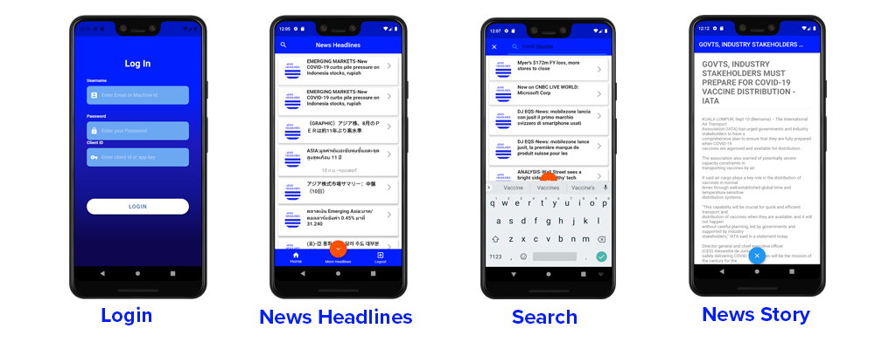

# Build News Headlines Mobile app using Flutter and RDP API

## Overview

This example consists of two folders. Each folder is a separate project.

* First Project is RDP Manager Console App is a console application that was created to the functionality of the RDP Manager class which provides a function to get Access Token from the RDP server. And to provide a function to search News headlines and get a News story. You can find full source files and documents from folder [rdp_manager_console_app](rdp_manager_console_app/).

* The second project is RDP News headlines Mobile application
It's the project under folder [rdp_mobile_news_flutter](rdp_mobile_news_flutter/) which is a mobile app created by using Google Flutter UI Toolkit and utilizes the dart library crated in the console app to retrieve data from the RDP server and display the news headlines and story content on Mobile UI. Users can test the app using Android Emulator or using ios emulator on macOS.

For the full article, please visit the following articles:
- [Build News Headlines Mobile app using Flutter and the Data Platform API (Part1)](https://developers.lseg.com/en/article-catalog/article/build-news-headlines-mobile-app-using-flutter-and-rdp-part1)
- [Build News Headlines Mobile app using Flutter and Data Platform API (Part 2)](https://developers.lseg.com/en/article-catalog/article/build-news-headlines-mobile-app-using-flutter-and-rdp-part1](https://developers.lseg.com/en/article-catalog/article/build-news-headlines-mobile-app-using-flutter-and-rdpapi-part-2).
