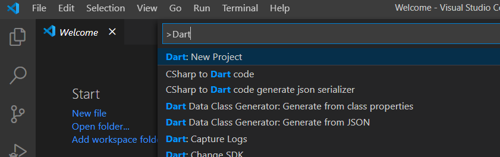
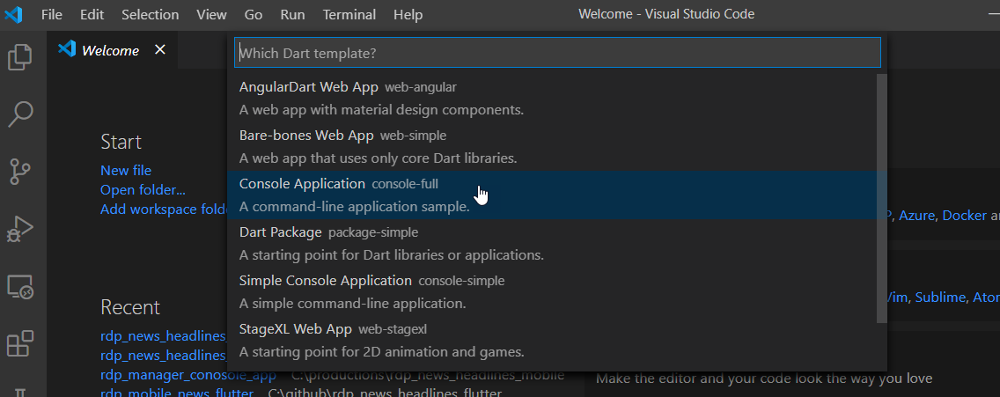

# Build News Headlines Mobile app using Flutter and RDP (Part1)

## Create RDP Manager class using Dart

This article demonstrates use-cases and workflows for building a mobile application to shows a News headline and story content from [Refinitiv Data Platform(RDP)](https://developers.refinitiv.com/refinitiv-data-platform). We will create a mobile demo application using the Flutter UI toolkit with a dart programming. We will use a [dart programming](https://dart.dev/) to create a class or library to support the functionality of the [RDP REST API](https://developers.refinitiv.com/refinitiv-data-platform/refinitiv-data-platform-apis). The main functionalities that we need to support is a function to get Access Token from the RDP server and a function to search a news headline and retrieve news story content from News services.

To create a mobile UI, we will use [Flutter UI toolkit](https://flutter.dev/) to build the app. Flutter can be natively compiled applications for mobile, web, and desktop from a single codebase. It is a free and open-source Google mobile UI framework that provides a fast and expressive way for developers to build native apps on both IOS and Android. You can also test the app on the Android emulator and ios emulator (macOS).

There are two parts for this article and this one is the first part to demonstrate how to use dart programming to create a class for retrieving News headlines data from RDP News services. The outcome from this article is a Dart library with a sample console app to test the functionality. The class will be used in the Mobile UI which is [Part 2](https://github.com/Refinitiv-API-Samples/Example.RDPAPI.Flutter.RdpNewsHeadlinesMobileApp/tree/master/rdp_mobile_news_flutter) of this article.

Below is a screenshot of the Flutter mobile app page break down by the use-case. We need to create a dart library to support these functions.


## Prerequisites

* Understand a basic concept of RDP and RDP REST API. We recommend you to read [RDP API GENERAL GUIDELINES](https://developers.refinitiv.com/refinitiv-data-platform/refinitiv-data-platform-apis/docs?content=72067&type=documentation_item) at the first steps. You can also test your RDP account with [API Playground](https://apidocs.refinitiv.com/Apps/ApiDocs) to understand the HTTP request and response messages the application has to send and receive.

* Install Flutter and Dart. To build and run the sample application, you can follow instructions from [Flutter dev](https://flutter.dev/docs/get-started/install) page to setup Flutter on Windows or macOS. You also need to install [Android Studio](https://developer.android.com/studio) as we need to use an Android emulator to test the Flutter app. Please understand the primary usage of the Dart programming language and Flutter. There are many useful articles internet, and you can also learn primary uses of Dart and Flutter from the Flutter developer site.

* [Visual Studio Code(VS Code)](https://code.visualstudio.com/). You can follow the setting from the Flutter Dev Getting start page to add the Flutter plugin to the visual studio code. Then you can use it to create a new project, write the codes, debug and then build and run the app on the emulator.

* A valid RDP account with permission to retrieve news headlines and stories from RDP News services.

## Create RDP Manager

In order to use RDP REST API, developer can use any programming language which support HTTP client library to send a HTTP request accroding to REST API specification to get the data from particular services. In this case we will build a mobile application using Google Flutter UI toolkit, therefore, we can use http client library provided in dart development kit to call a REST API.

We will  create a class or library to provide interfaces to support funtionality of the REST API. It will use dart http library to handle the HTTP requests and responses from the RDP server. The library will support the following functionally on the RDP Services.

1) Get OAuth2 access token.
This function will manage to get OAuth2 access token from RDP server. We need to pass username,password and client id in the Http request message to get the access token. Or we can use refresh token to get the new access token from the server after the token is expired. The application has to pass the access token to HTTP request header when calling the REST API to access the resource on the server.

2) Search a news headlines. It will return a list of news headlines including its metadata from the News headline service.

3) Retrieve a news story including metadata from a News story service. User must pass story id associated with the news headline to the function.

## Implementations

Please note that the we ports the application logics to handle the HTTP request and response message from [C# websocket-api example](https://github.com/Refinitiv/websocket-api/tree/master/Applications/Examples/EDP/CSharp) provided on [Github](https://github.com/Refinitiv-API-Samples/Example.RDPAPI.Flutter.RdpNewsHeadlinesMobileApp).

Let start creating new dart console app using Visual Studio Code. You can press Ctrl+Shift+p (on windows) and then type 'Dart' and select __Dart:New Project__ as below screen shot.



 Then select Console Application.

 

It will ask you to provide a project name and select location to generate the project files. Visual Studio Code will create new console app with a sample codes for you. Then you can modify or delete default files and replace it with our codes.

You can download the whole projects and source files from [Github](https://github.com/Refinitiv-API-Samples/Example.RDPAPI.Flutter.RdpNewsHeadlinesMobileApp).It's the project under folder rdp_manager_console_app. You can find RDP Manager class under folder 'lib/rdp'.

In this article, we will omit some codes and show you only a snippet of codes required for implement the function.

### Building RDP Manager class

This class is a main class to manage data and provide interface to retrieve contents from RDP. You can find full source codes from file __\<project folder\>/lib/rdp/rdp_manager.dart__. You can find the main interfaces for the class from the following snippet codes.

```dart
class RdpManager {
  String clientId;
  String refreshToken;
  String scope;
  String userName;
  String userPassword;
  rdpMsgData.AccessToken accessTokenInfo;
  //Get OAuth2 acccess token from the server
  Future<rdpMsgData.TokenResponse> getAuthenticationInfo(bool useRefreshToken,{String userName,String userPassword,String clientId,String refreshToken,String scope = 'trapi',String url}){
        // Implementations
      };
  //Get News headlines from the server
  Future<rdpMsgData.NewsHeadlineResp> getNewsHeadlines(
      rdpMsgData.AccessToken accessToken,
      {String query,
      String cursor})
      {
        // Implmentations
      };
  //Get News Story from the server
  Future<rdpMsgData.NewsStoryResp> getNewsStory(
      rdpMsgData.AccessToken accessToken, String storyId)
      {
        // Implementations
      };
}

```

### Add function to get OAuth2 access token

__getAuthenticationInfo__  is a function to get a username, password and client id from user input and then send Login request to the token endpoint to get the OAuth2 access token. This is the first method that application has to call when using RDP services. This is because when you try to access resource on another services, you need to pass a valid access token in Authorization header of the HTTP reqeust message. Please find more details about the [Authorization](https://developers.refinitiv.com/refinitiv-data-platform/refinitiv-data-platform-apis/learning?content=38562&type=learning_material_item) from [Tutorial Page](https://developers.refinitiv.com/refinitiv-data-platform/refinitiv-data-platform-apis/learning?content=38560&type=learning_material_item).

The root endpoint for REST API calls is:

```url
https://api.refinitiv.com
```

Endpoint for Token Service:

```dart
/auth/oauth2/<VERSION>/token
```

We will defined list of endpoint in __'\<project>/lib/rdp/rdp_endpoints.dart__

```dart
class RdpEndpoints {
  static const String rdp_hostname = "api.refinitiv.com";
  static const String authTokenUrl = '/auth/oauth2/v1/token';
  static const String streamServiceDiscUrl = '/streaming/pricing/v1/';
  static const String newsHeadlinesUrl = '/data/news/v1/headlines';
  static const String newsStoriesUrl = '/data/news/v1/stories';
}
```

Below is a snippet of codes for the implementation of the getAuthenticationInfo interface. It will return data as TokenResponse class which implemented in __'\<project>/lib/rdp/rdp_message_data.dart__. The method use http client interface from dart package so the app has to import http library.

```dart
import 'package:http/http.dart' as http;
```

Create http headers;

```dart
    var headerList = <String, String>{};
    // Set Http Request Headers
    headerList['Content-Type'] = 'application/x-www-form-urlencoded';
    headerList['Accept'] = 'application/json';
    headerList['AllowAutoRedirect'] = 'false';
```

Create JSON request body and pass the username,password and client id to the message. Or just pass refresh_token in case that the access token about to expired.

```dart
    // Construct JSON body for the Authentication request.
    var body = {};
    body['username'] = this.userName;
    body['client_id'] = this.clientId;
    if (useRefreshToken) {
      body['grant_type'] = 'refresh_token';
      body['refresh_token'] = this.refreshToken;
    } else {
      body['takeExclusiveSignOnControl'] = 'true';
      body['grant_type'] = 'password';
      body['scope'] = this.scope;
      body['password'] = this.userPassword;
    }
```

Then use http client class to send a post message to a Token endpoint to get the new access token.

```dart
    var tokenResp = rdpMsgData.TokenResponse();
    var client = http.Client();
    try {
      var getTokenUri =
          Uri.https(RdpEndpoints.rdp_hostname, RdpEndpoints.authTokenUrl);
      var httpResponse =
          await client.post(getTokenUri, headers: headerList, body: body);
      //Handle http response message
      //...
     } on SocketException catch (e) {
      print('SocketError Exception ${e.message}');
      tokenResp.errorType = "SocketException";
      tokenResp.errorDescription = e.message;
    } catch (e) {
      print("Unhandled Exception $e");
      tokenResp.errorType = 'Unhandled Exception';
      tokenResp.errorDescription = 'Unhandled Exception $e';
    } finally {
      client.close();
    }
```

Process HTTP resonse message and get access token from the JSON message. Or process to get the errror details from the response or exception in case that the it fails. And then return TokenResp to the application.

```dart
      if ((httpResponse.headers.containsKey('Transfer-Encoding') &&
              httpResponse.headers['Transfer-Encoding'] == 'chunked') || httpResponse.body.isNotEmpty)
      {
        tokenResp.statusCode = httpResponse.statusCode;
        tokenResp.reasonPhase = httpResponse.reasonPhrase;
        tokenResp.errorType =
            (json.decode(httpResponse.body) as Map<String, dynamic>)['error'];
        tokenResp.errorDescription = (json.decode(httpResponse.body)
            as Map<String, dynamic>)['error_description'];

        if (httpResponse.statusCode == 200 && httpResponse.contentLength > 0) {
          var accessTokenData = rdpMsgData.AccessToken.fromJson(
              json.decode(httpResponse.body) as Map<String, dynamic>);
          tokenResp.tokenData = accessTokenData;
        }
        // Handle HttpResponse status code
        switch (httpResponse.statusCode) {
          case 301:
          case 302:
          case 307:
          case 308:
            // Perform URL redirect
            client.close();
            print('${httpResponse.statusCode} ${httpResponse.reasonPhrase}');
            String newHost = httpResponse.headers['Location'];
            if (newHost != null && newHost.isNotEmpty) {
              tokenResp =
                  await getAuthenticationInfo(useRefreshToken, url: newHost);
            }
            break;
        }
      }
    accessTokenInfo = tokenResp.tokenData;
    return tokenResp;
```

### Create function to get News headlines

Basically a get headlines operation is an endpoint under News Services group(/data/news/v1/) according to the [API Docs page](https://apidocs.refinitiv.com/).

#### __Get Headlines endpoint__

```dart
/data/news/Version/headlines
```

#### __Query Parameters__

The user has an option to pass additional query parameters to get specific content to relate to the keyword in the query. The following parameters are request options.

* __query__

  The user search query. It supports Analyze operation. Analyze operation computes a tree expression from a user query string. It would break down a user query string into News related entities, then aggregate them into a boolean filtering tree. You can find more details of Analyze operation from the API Docs page.

* __limit__
  Limit of headline (default 10, range value: [0, 100])

* __cursor__
  The cursor is a pagination cursor that can be used to retrieve information by pages. Two cursors are __prev__ and __next__ depending on the direction in which you want to paginate. Most of our paginated endpoints support a cursors based syntax. Initial search results always return pagination information with all search contexts and can be used in the next page search.

  Here is an example of cursors present in the response of headlines:

  ```json
  {
    "data": [],
    "meta": {
      "next": "H4sIAAAAAAAAABWMsQ7CIBiE3+VWMQEikNZdt7qYGN0I/QcShAZKrWn67uJ2d9/dbXjb1aUaZ/SCYfJLampDpE/xI3oIpc2Ja2OkVipehodyz/h9HSQXHe+4PPNjC8Hgy0Br22LOlbAzlJT/tj3d0y2MrZIp0GKjo2tOdWrMhoD9B/aNdOODAAAA",
      "prev": "H4sIAAAAAAAAABWMwQrCMBiD3yVXJ7TFtmze9TYvguitdL9QqO1o3ZyMvbu/tyRfkhUvt/g8pTc62WAMc2a1ItGnhgEdpDb2IIy1ymidTv1N+3v6PnZKyFa0Qh3FnkM0CLWnhbd4ulgJW4Oay9/z1TVf4sCdQpFmlzydS55GZi5GbD9x8rfohAAAAA=="
    }
  }
  ```

  Then to get the next page for the same context use cursor value from initial search:

  ```dart
  /headlines?cursor=H4sIAAAAAAAAABWMsQ7CIBiE3%2BVWMQEikNZdt7qYGN0I%2FQcShAZKrWn67uJ2d9%2FdbXjb1aUaZ%2FSCYfJLampD
  ```

* __Sort Order__
  
  Support three values:
  * __New to Old__ (default)
  * __Old to New__
  * __Most Read__
  
  If the MostRead sort order was selected, you could specify the date range for most read headlines using mostReadDateFrom and mostReadDateTo parameters.

    For example:

    ```dart
    /headlines?query=TOPNEWS&sort=mostRead&mostReadDateFrom=2011-10-10&mostReadDateTo=2018-10-10
    ```

    If mostReadDateFrom or/and mostReadDateTo specified, but the sort order is not equal to mostRead, values will be ignored.

* __Relevancy__

  Three values are supported:
  * Filter on High relevance should return results for just HIGH
  * Filter on "Medium" relevance should result for Medium+HIGH
  * Filter on "All" relevance should result for Low+Medium+HIGH
  
  For example,

  ```dart
  headlines?query=A&relevance=Medium
  ```

#### Response Data

The response data is a JSON message contains fields that represent information such as a story id with headlines, text, and metadata; you can find a list of available fields and its usage from [APIDocs](https://apidocs.refinitiv.com/Apps/ApiDocs).

In this example app, we will parse only fields we are interested such as a list of story id and its headlines, and keep it in our data structure so the application can get the list and shows it in the  UI.

Below is a class NewsHeadlineResp, which used to hold the News headlines response; we use it to cache the data from the Http response message.

```dart
class NewsHeadlineResp implements ResponseMsg {
  List<NewsHeadlinesData> headlinesDatas;
  NewsHeadlineMeta metaInfo;

  @override
  int statusCode;

  @override
  String reasonPhase;

  @override
  String errorType;

  @override
  String errorDescription;
}
```

The following codes are implementations of the __getNewsHeadlines__ method.
It starts with creating HTTP headers.

```dart
var headerList = <String, String>{};
    headerList['Accept'] = 'application/json';
    headerList['AllowAutoRedirect'] = 'false';
    headerList['Authorization'] =
        '${accessToken.tokenType} ${accessToken.accessToken}';
```

Build a query parameters. There are two type of the options supported by the app for now, that are query and cursor to get next page for the same data context;

```dart
 var queryParameters = Map<String, String>();
      if (query != null)
        queryParameters['query'] = query;
      else if (cursor != null) queryParameters['cursor'] = cursor;
var serverUri = Uri.https(RdpEndpoints.rdp_hostname,
    RdpEndpoints.newsHeadlinesUrl, queryParameters);
```

And then use http get to retrieve data using headlines endpoints and query parameters.

```dart
   rdpMsgData.NewsHeadlineResp headlinesResp = rdpMsgData.NewsHeadlineResp();
   var client = http.Client();
   var httpResponse = await client.get(serverUri, headers: headerList);
      headlinesResp.statusCode = httpResponse.statusCode;

      if (httpResponse.statusCode != 200) {
        headlinesResp.reasonPhase = httpResponse.reasonPhrase;
        headlinesResp.errorType =
            (json.decode(httpResponse.body) as Map<String, dynamic>)['error'];
        headlinesResp.errorDescription = (json.decode(httpResponse.body)
            as Map<String, dynamic>)['error_description'];
      }
```

If success we start parsing JSON message from the HTTP response. Below is a sample of the JSON message for the headlines response. Omit some parts to show a short message.

```json
{
  "data": [
    {
      "storyId": "urn:newsml:reuters.com:20200911:nDJR9QcThk:1",
      "newsItem": {
        "_version": 1,
        "contentMeta": {
          "audience": [
            {
              "_qcode": "NP:MFDJ"
            }
          ],
          "creator": [
            {
              "_qcode": "NS:DJN",
              "_role": "sRole:source"
            }
          ],
          "infoSource": [
            {
              "_qcode": "NS:DJN",
              "_role": "sRole:source"
            },
            {
              "_qcode": "NS:DJN",
              "_role": "sRole:origProv"
            }
          ],
          "language": [
            {
              "_tag": "it"
            }
          ],
          "subject": [
            {
              "_qcode": "M:1QD"
            }
          ],
          "urgency": {
            "$": 3
          }
        },
        "itemMeta": {
          "firstCreated": {
            "$": "2020-09-11T09:19:17.053Z"
          },
          "versionCreated": {
            "$": "2020-09-11T09:19:17.053Z"
          },
          "title": [
            {
              "$": "TOP STORIES MONDO: Microsoft denuncia attacchi hacker contro elezioni Usa"
            }
          ]
        }
      }
    },
    {
      "storyId": "urn:newsml:reuters.com:20200911:nDjcBkpdM:1",
      "newsItem":
      {
          "title": [
            {
              "$": "TOP STORIES MONDO: Microsoft denuncia attacchi hacker contro elezioni Usa"
            }
          ]
      }
  }
  ,
  {

  }
  ],
  "meta": {
    "count": 10,
    "pageLimit": 10,
    "next": "H4sIAAAAAAAAABWNywrCMBAA/2WvVkjEgo2nguDJCrWexENotxpYk5KkL0r/3e1x9jGzQGsooge1QJw7BAWtR4w4RUhg0NRvo+cjZ2pJfwKoF3xRN2QswntN4Ken2vU2gpIigc4MLm4yi2MwDf/KNMtOMhVHcRCpLcq8Hme04+7ALDIpz2J/yatbVXLBhGILK4ieuywPzm/IssrdqeETj4SDtjVeves73mkiWP/ASLWpxwAAAA==",
    "prev": "H4sIAAAAAAAAABWOQQuCQBCF/8tcM1gLqbVTIAQejMpO0WHRMZemXdldzRD/e+PlwZs3882boNEU0EE6Qfh1CCk0DjHgGCCCQVG/jO63I7uG1MtD+oAWVU3aIDznCD5qrGxvAqSxiKDTgw0LzODX65pv40TKPUuyE8nWZPlVXqqyfa82YiOEjOODWGd5wXjti+UrF1DkERjtrVs8o0p7ppp3HBIOylR4crbvOFNEMP8BPZN3Z8UAAAA="
  }
}
```

The following codes is a sample codes the application used to parse the data from JSON message. It starts from parsing an array of story is under __data__ node.

```dart

          // Get a list contains story id.
          var headlinesList = (json.decode(httpResponse.body)
              as Map<String, dynamic>)['data'] as List<dynamic>;
          if (headerList != null) {
            List<rdpMsgData.NewsHeadlinesData> newsHeadlinesDataList =
                List<rdpMsgData.NewsHeadlinesData>();

            // Parsing Meta tag to get next and prev cursor
            var metaInfo = (json.decode(httpResponse.body)
                as Map<String, dynamic>)['meta'] as Map<String, dynamic>;
            if (metaInfo != null) {
              rdpMsgData.NewsHeadlineMeta metaData =
                  rdpMsgData.NewsHeadlineMeta.fromJson(metaInfo);
              headlinesResp.metaInfo = metaData;
            }

            // Iterate through each node in array to get story id, firstcreated, version created and headline title.
            headlinesList.forEach((element) {
              var headlinesJsonData = element as Map<String, dynamic>;
              var newsHeadlines = rdpMsgData.NewsHeadlinesData();
              headlinesJsonData.forEach((key, value) {
                switch (key) {
                  case 'storyId':
                    newsHeadlines.storyId =
                        headlinesJsonData['storyId'] as String;
                    break;
                  case 'newsItem':
                    {
                      (value as Map<String, dynamic>).forEach((key2, value2) {
                        if (key2 == 'itemMeta') {
                          (value2 as Map<String, dynamic>)
                              .forEach((key3, value3) {
                            switch (key3) {
                              case 'firstCreated':
                                newsHeadlines.firstCreated = (value3
                                    as Map<String, dynamic>)['\$'] as String;
                                break;
                              case 'versionCreated':
                                newsHeadlines.firstCreated = (value3
                                    as Map<String, dynamic>)['\$'] as String;
                                break;
                              case 'title':
                                String contentText = "";
                                (value3 as List<dynamic>).forEach((item) {
                                  item.forEach((key4, value4) {
                                    if (key4 == '\$') {
                                      var content = value4;
                                      contentText +=
                                          (content == null) ? "" : content;
                                    }
                                  });
                                });
                                newsHeadlines.titleText = contentText;
                                break;
                            }
                          });
                        }
                      });
                    }
                    break;
                          }
              });
              newsHeadlinesDataList.add(newsHeadlines);
            });
            headlinesResp.headlinesDatas = newsHeadlinesDataList;
          }

```

### Create function to get News Story

#### Get Story endpoint

```dart
/stories/{story id}
```

Example

```url
https://api.refinitiv.com/data/news/v1/stories/urn%3Anewsml%3Areuters.com%3A20190531%3AnL3N25U0E5
```

#### Get Story Content

The story can be retrieved using JSON or HTML format. And to select a story format, two options are available:

Set accept header:

* text/html
* application/json

extension

* json
* html
  
The extension has a higher priority than the header. It means that if, for example, accept header equal to "text/html", but story ID send as sampleStory.json result will be in JSON format. Using html is quite complicated than json format, which provided news story in plain text. You can find more details about the format of Html from the [APIDocs](https://apidocs.refinitiv.com/Apps/ApiDocs) page.

Note that our function will support only 'application/json' format, so it accepts only one input, which is a story id.

Same as the function to get news headlines, we create a class named NewsStoryResp to hold data from the response message. And below is a snippet code of the class.

```dart

class NewsStoryResp implements ResponseMsg {
  NewsStoryData newsContent;

  @override
  int statusCode;

  @override
  String reasonPhase;

  @override
  String errorType;

  @override
  String errorDescription;
}
```

The __getNewsStory__ function starts from creating the header using the same codes as news headlines, and we need to append the story id to the end of the endpoint like the following snippet of codes.

```dart
var serverUri = Uri.https(
          RdpEndpoints.rdp_hostname, '${RdpEndpoints.newsStoriesUrl}/$storyId');
```

Then applications need to use the HTTP GET method to retrieve a News Story content.

```dart
 var httpResponse = await client.get(serverUri, headers: headerList);
      storyResp.statusCode = httpResponse.statusCode;
```

Last steps, we need to parse the JSON message to get content.

The function will parse only a language tag, headline text, and a news story in plain text format.
The whole JSON Message contains a lot of metadata, so it quite long. We will omit unwanted nodes and focus only on the following JSON data.

#### Story Content

Node inlineData and inlineXml is a different representation of the same data. inlineData is a text representation, inlineXml is a formatted HTML markup which is ready to be used on HTML pages. Anyway, our function will parse content from inlineData node only.

```json
    "contentSet": {
      "inlineData": {
        "$": "string",
        "_contenttype": "string"
      },
      "inlineXml": {
        "$": "string",
        "_contenttype": "string"
      }
    }
```

#### Language

It represents a list of Language in the news content.

```json
 "contentMeta": {
    "language": [
        {
            "_tag": "en"
        }
    ]
 }
```

#### Title

Title is a short description of the news.

```json
"contentMeta": {
    "title": [
        {
            "$": "Bridgestone Enjoys Successful Olympic Winter Games Debut, Turns Attention to Olympic Games Tokyo 2020; Worldwide Olympic Partner&apos;s first global pro..."
        }
    ]
}
```

Below is a snippet of codes that the function used to parse data from the JSON message.

```dart
          var newsStoryData = rdp_message.NewsStoryData();

          var newsItemData = (json.decode(httpResponse.body)
              as Map<String, dynamic>)['newsItem'] as Map<String, dynamic>;
          if (newsItemData != null) {
            // Extract language
            ((newsItemData['contentMeta'] as Map<String, dynamic>)['language']
                    as List<dynamic>)
                .forEach((element) {
              if ((element as Map<String, dynamic>).containsKey('_tag')) {
                newsStoryData.newsTitle =
                    (element as Map<String, dynamic>)['\$'];
              }
            });

            // Extract News Title
            ((newsItemData['contentMeta'] as Map<String, dynamic>)['headline']
                    as List<dynamic>)
                .forEach((element) {
              if ((element as Map<String, dynamic>).containsKey('\$')) {
                newsStoryData.newsTitle =
                    (element as Map<String, dynamic>)['\$'];
              }
            });

            // Extract News Title
            ((newsItemData['contentSet'] as Map<String, dynamic>)['inlineData']
                    as List<dynamic>)
                .forEach((element) {
              if ((element as Map<String, dynamic>).containsKey('\$')) {
                newsStoryData.newsContent =
                    (element as Map<String, dynamic>)['\$'];
              }
            });
            storyResp.newsContent = newsStoryData;
          }
```

## Test the functionality

After creating the three functions, it's time to test and see if it works as we expected or not.

There is the main function implemented in file __bin/main.dart__. It will start when you run dart command or debug on Visual Studio code.

The application flow starts from the login to the RDP server and gets an access token. Then pass a query to getNewsHeadlines. The application will receive a list of headlines with story id. The last steps it will iterate through the list and call getNewStory to get a new content one by one and print to console.

Below is a snippet of codes from the primary function. It starts from setting the RDP account and set a query text to search headlines.

```dart
  rdp.userName = '<RDP Username>';
  rdp.userPassword = '<RDP Password>';
  rdp.clientId = '<RDP Client ID>';
  var headlinesQuery = '(Apple Iphone12) and searchIn:FullStory';
```

Then get OAuth2 Access Token and if it success, start a Timer to get a refresh token.

```dart
  // Step1 :  Get Access Token
  var tokenResp = await rdp.getAuthenticationInfo(false);

  if (tokenResp != null) {
    if (tokenResp.statusCode == 200) {
      PrintTokenInfo(tokenResp);
      if (runLoop) {
        Timer.periodic(
            Duration(seconds: (tokenResp.tokenData.expiresIn * 0.9).round()),
            (time) async {
          myTimer = time;
          if (tokenResp.statusCode == 200 &&
              tokenResp.tokenData != null &&
              tokenResp.tokenData.refreshToken != null) {
            tokenResp = await GetNewToken(tokenResp.tokenData.refreshToken);
          }
        });
      }
```

Next step, pass the Access Token to the getNewsHeadlines function and getNewsStory function to retrieve data from News service

```dart
    /// Run the loops to display news headline and fetch headlines
    /// from next page cursor until it reach page count limit.

    rdp_message.NewsHeadlineResp newsHeadlines;
    var pageIndex = 0;
    var pageCount = 0;
    do {
      if (newsHeadlines == null) {
        newsHeadlines = await rdp.getNewsHeadlines(tokenResp.tokenData,
            query: headlinesQuery);
      } else {
        newsHeadlines = await rdp.getNewsHeadlines(tokenResp.tokenData,
            cursor: newsHeadlines.metaInfo.next);
      }
      if (newsHeadlines.statusCode == 200) {
        if (pageCount == 0) pageCount = newsHeadlines.metaInfo.count;
        print('Headlines Page#${pageIndex + 1}/$pageCount');
        newsHeadlines.headlinesDatas.forEach((element) async {
          print('${element.storyId} ${element.titleText}');
          var storyResp =
              await rdp.getNewsStory(tokenResp.tokenData, element.storyId);
          if (storyResp.statusCode == 200) {
            print('StoryId:${element.storyId}');
            print('Title:${storyResp?.newsContent?.newsTitle}');
            print('=======================================');
            print(storyResp.newsContent.newsContent.replaceAll('\n', '\r\n'));
          }
        });
        print('');
        print('next ===>${newsHeadlines.metaInfo.next}');
      } else {
        print(
            'Error => ${newsHeadlines.statusCode} ${newsHeadlines.errorDescription} Stop');
        break;
      }
    } while (++pageIndex < newsHeadlines.metaInfo.count);
```

### Running the app

Please download full projects and source files from [Github](https://github.com/Refinitiv-API-Samples/Example.RDPAPI.Flutter.RdpNewsHeadlinesMobileApp).

There are two folder in the git repository. Go to folder __rdp_manager_conosole_app\bin__ first.

You might need to start Terminal and run [pubtool](https://dart.dev/tools/pub/cmd/pub-get) by typing __pub get__ or __flutter pub get__ command to get the libraries required by the app.

Then modify 'bin/main.dart' and change following lines to your RDP account.

```dart
rdp.userName = '<RDP Username>';
rdp.userPassword = '<RDP Password>';
rdp.clientId = '<RDP Client ID>';
```

and then change the headlinesQuery to a query you want to search in the following line:

```dart
 var headlinesQuery = 'Put your query here';
```

Next step run dart application using the following command.

```bash
dart bin\main.dart
```

You will see Access Token print to console when the login is successful, and then the application will print the headline followed by story id and start retrieving a story.

Sampel Output

```bash
StatusCode:200
Token Type:Bearer
AccessToken:eyJ0eXAiOiJhdCtqd3QiLCJhbGciXXXXXXNUnibfnHkkCYYE4mrVgWN5_sEG9Y1FRhZdKwE147f7Jqi3mz0gqg4dM8WBZAC3LNRaBcKUTxYyQeE7r_8vR3j2w
RefreshToken:XXX8156-2XXXXXXXX7e5809522bb
Expired in:300 second

Headlines Page#1/10

urn:newsml:reuters.com:20200914:nRscdgmNDa:4 STM.PA: STMicroelectronics NV - Modeling for near term strength, but FX headwinds in 2021 (9 pages) - Credit Suisse
urn:newsml:reuters.com:20200914:nRscdgmNya:2 AMS.S: ams AG - 2H drivers in play - iPhone builds at ams and Auto recovery at Osram (9 pages) - Credit Suisse
urn:newsml:reuters.com:20200915:nRscdgmFJa:2 Electronics-苹果新品即将发布，关注消费电子产业机遇-09/12/2020 (10 pages) - Chuancai Securities Co., Ltd
urn:newsml:reuters.com:20200914:nRscdglqNa:2 AUERBACH GRAYSON: Asia Daily Morning Note 09-14-20:  (AAC Technologies, Accton, Air China, China Resources Land, Berli Jucker, Cheng Loong Paper, China Eastern Airlines, China Southern Airlines, Chongqing Brewery, Oncosil Medical, CP All) (32 pages) - Auerbach Grayson & Co., Inc.
urn:newsml:reuters.com:20200914:nRscdglfda:1 KR:  IT Hardware Industry: Anticipation rising towards 2H20 earnings for smartphone and foundry players (97 pages) - DBS Bank
urn:newsml:reuters.com:20200914:nRscdgkzna:1 华为发布鸿蒙 2.0 ， 8 月特斯拉国内销售 1.18 万辆-09/14/2020 (17 pages) - CITIC Securities
urn:newsml:reuters.com:20200914:nRscdgkxXa:2 テクノロジーセクター: CS Japan Tech Weekly（Vol.20）：先週の振り返りと今週の注目ポイントを整理 (21 pages) - Credit Suisse
urn:newsml:reuters.com:20200911:nRscdgcDJa:4 ITM Semiconductor (084850 KS)ΓÇöMultiple New Business Opportunities in FY21 (6 pages) - Haitong International Research
urn:newsml:reuters.com:20200911:nRscdgc3ca:1 KGI凱基台灣投資領航日報 -- 2020年09月11日 (27 pages) - KGI Greater China
urn:newsml:reuters.com:20200911:nRscdgc25a:1 KGI Taiwan Daily Navigator ΓÇôSeptember 11, 2020 (33 pages) - KGI Greater China

StoryId:urn:newsml:reuters.com:20200910:nRscdg9yra:1
Title:AUERBACH GRAYSON: Taiwanese Strategy - APPLE  CONCEPTS  HAVE  THE  ADVANTAGE  OF  THREE  LOWS; IPHONE 12 WILL LURE BACK CAPITAL (Taiwan) (7 pages) - Auerbach Grayson & Co., Inc.
=======================================
R E S E A R C H R E P O R T D I S T R I B U T E D B Y The attached research report and the excerpts from the research report below were written entirely by a broker partner of Auerbach Grayson, and not by Auerbach Grayson. Auerbach Grayson is distributing/providing this research report for your consideration. P R E P A R E D B Y RESEARCH Market Report Taiwan Taiwanese Strategy September 10, 2020 APPLE CONCEPTS HAVE THE ADVANTAGE OF THREE LOWS; IPHONE 12 WILL LURE BACK CAPITAL > TaiwanΓÇÖs Apple (US) concepts stocks (excluding semiconductor) have foreign capital holdings of only 43.6%, the lowest point since 2015 and down significantly from the peak of 54.8% in 2017, which could be attributed to interference from the Sino-US trade war/tech war, the emergence of the red supply chain, and the impact of COVID19 on consumption. Going forward, with these negatives priced in to some extent and iPhone 12 coming up, which should help 4Q20 overall iPhone shipment growth YoY turn positive, foreign capital might be lured back to replenish stocks. In addition, foreign capital has had a habit of underweighting before product launches and buying back the stocks if the product sales are better than expected, and if iPhone 12 indeed is well received by market, then there is a chance foreign capital will return to replenish stock holdings. > Taiwanese Apple concepts'
...
traders@agco.com ops@agco.com Chief Executive Officer Managing Director, Head of Equities Managing Director, Global Trading Managing Director, Global Operations Asia Sales Asia Sales Asia Sales Asia / China Sales CEEMEA & LATAM Sales CEEMEA & LATAM Sales Global Emerging Markets Western Europe Sales Asia Trading Emerging Market Trading Emerging Market Trading Emerging Market Trading Western Europe Trading US & LATAM Trading Director, Global Capital Markets 1.212.453.3553 1.212.453.3545 1.212.557.4444 1.212.453.3518 david@agco.com adelafuente@agco.com gballantyne@agco.com fmuller@agco.com 1.212.453.3541 1.212.453.3515 1.212.453.3561 1.212.453.3539 1.212.453.3586 1.212.453.3571 44.773.941.0717 1.212.453.3538 hfukuchi@agco.com jhong@agco.com akukreja@agco.com jxiang@agco.com mdaoud@agco.com smandel@agco.com idevilder@ageurope.co.uk slueck@agco.com 1.212.557.4444 1.212.557.4444 1.212.557.4444 1.212.557.4444 1.212.557.4444 1.212.557.4444 mikelopiano@agco.com jkrase@agco.com ppeters@agco.com spollicino@agco.com kwood@agco.com ggimber@agco.com 1.212.453.3573 nbhatnagar@agco.com Trading Desk Hours (New York Time) ΓÇô Sunday 4:00 pm to Friday 5:00 pm (24 Hours) *After trading hours, please call 1.212.557.4444 and you will automatically be connected to a trader. Research Research Coordinator Information Services Ismael Sadek Settlement Information Technology 1.212.453.3549 1.212.453.3512 1.212.557.4478 research@agco.com it@agco.com ops@agco.com YOUR LOCAL BROKER IN OVER 125 MARKETS Auerbach Grayson & Company, LLC WORLDWIDE 25 West 45th Street New York, NY 10036 Telephone 212 557 4444 Toll-Free 1 800 31world web www.agco.com  

```

## Summary

In this article, we have described how to create a function to get Access Token from RDP and implement a function to retrieve news headlines and get its story content from a News Services using Dart programming. It also provide a sample codes to parse a data returns from the RDP News services. You can add your own method to get additional data from the JSON message.

The library would be used to develop a mobile app in [Part 2](https://github.com/Refinitiv-API-Samples/Example.RDPAPI.Flutter.RdpNewsHeadlinesMobileApp/tree/master/rdp_mobile_news_flutter) of this article. In the second part, we will describe how to integrate the functions from the class with a Flutter UI toolkit to create a Mobile app. Users can deploy the app on android or ios and then use the app to log in to the RDP server and retrieve news headlines from user input. Let see the implementation in the second part.

## References

* [Refinitiv Data Platform (RDP)](https://developers.refinitiv.com/refinitiv-data-platform).
* [Refinitiv Data Platform REST API](https://developers.refinitiv.com/refinitiv-data-platform/refinitiv-data-platform-apis).
* [RDP API GENERAL GUIDELINES](https://developers.refinitiv.com/refinitiv-data-platform/refinitiv-data-platform-apis/docs?content=72067&type=documentation_item).
* [Dart Tutorial](https://dart.dev/tutorials).
* [Flutter Document](https://flutter.dev/docs).
* [APIDocs](https://apidocs.refinitiv.com/Apps/ApiDocs)
* [Example.RDPAPI.Flutter.RDP_News_Headliens_Flutter](https://github.com/Refinitiv-API-Samples/Example.RDPAPI.Flutter.RdpNewsHeadlinesMobileApp)
