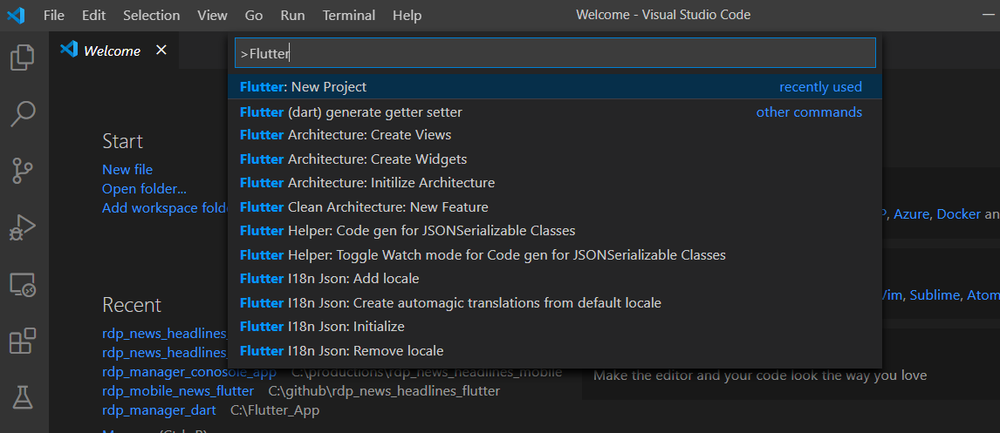
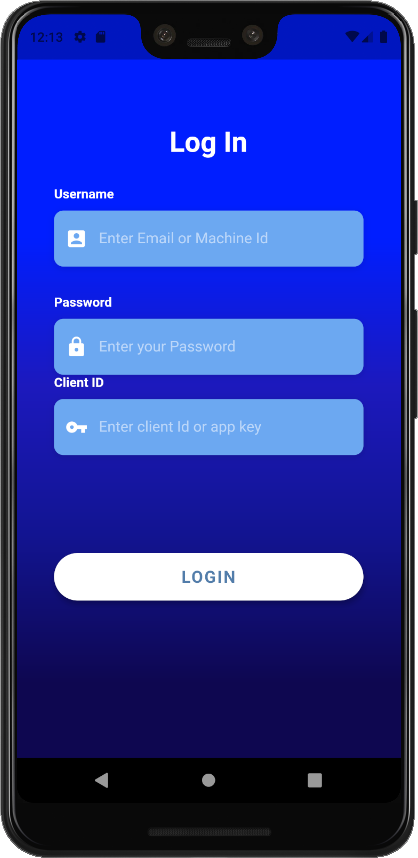
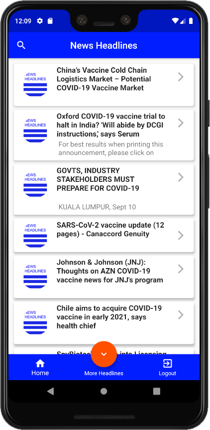
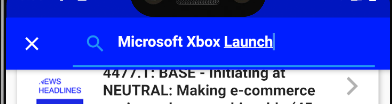
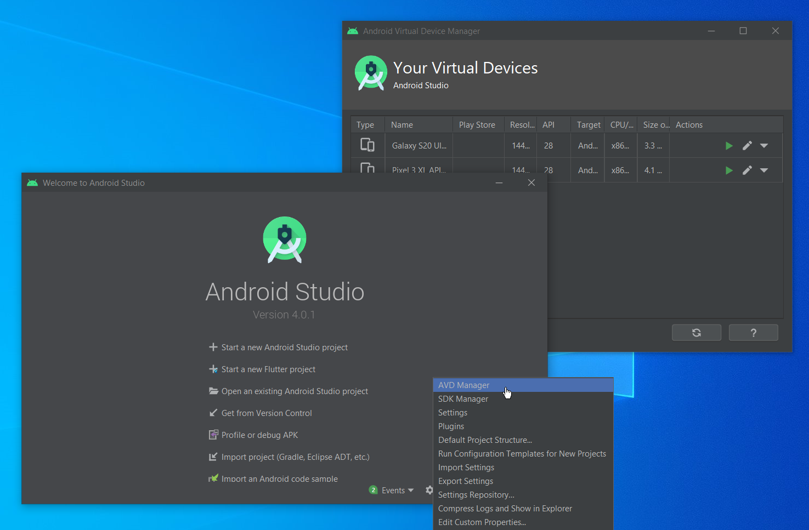
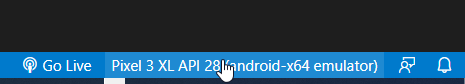
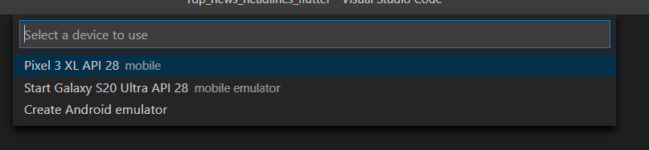
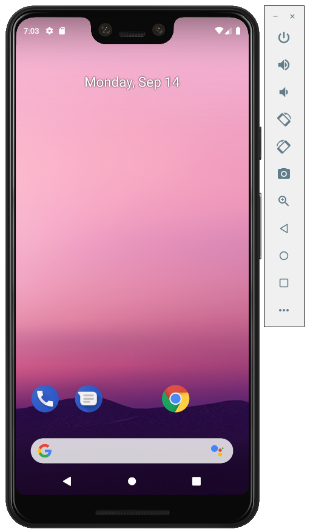

# Build News Headlines Mobile app using Flutter and RDP API (Part 2)

## Create Flutter Mobile UI

There are two parts of the article, and this is part2 to create a mobile demo app using the Flutter UI toolkit. Flutter is a free and open-source Google mobile UI framework that provides a fast and expressive way for developers to build native apps on both IOS and Android. We will use it to create UI to shows a News headline and story content from [Refinitiv Data Platform(RDP)](https://developers.refinitiv.com/refinitiv-data-platform). There will be three main UI pages in the mobile application that are a page to get login from the user, a page to search and display a list of news headlines, and a page to show a news story. Each page will use functions from the RDP Manager class, which created in [Part1](https://github.com/Refinitiv-API-Samples/Example.RDPAPI.Flutter.RdpNewsHeadlinesMobileApp/tree/master/rdp_manager_console_app) to handle login and retrieve data.

## Prerequisite

* Understand a basic concept of RDP and RDP REST API. We recommend you to read [RDP API GENERAL GUIDELINES](https://developers.refinitiv.com/refinitiv-data-platform/refinitiv-data-platform-apis/docs?content=72067&type=documentation_item). You can also test your RDP account with [API Playground](https://apidocs.refinitiv.com/Apps/ApiDocs) to understand the HTTP request and response messages the application has to send and receive.

* Read [Part1](https://github.com/Refinitiv-API-Samples/Example.RDPAPI.Flutter.RdpNewsHeadlinesMobileApp/rdp_manager_console_app) of this article. You need to understand the functionality of the RDP Manager class. We need to use the functions to retrieve data in the Mobile app.

* Install Flutter and Dart. To build and run the sample application, you can follow instructions from [Flutter dev](https://flutter.dev/docs/get-started/install) page to setup Flutter on Windows or macOS. You also need to install [Android Studio](https://developer.android.com/studio) as we need to use an Android emulator to test the Flutter app. Please understand the basic usage of the Dart programming language and Flutter. There are many useful articles internet, and you can also learn primary uses of Dart and Flutter from the Flutter developer site.

* [Visual Studio Code(VS Code)](https://code.visualstudio.com/). You can follow the setting from the Flutter Dev Getting start page to add the Flutter plugin to the visual studio code. Then you can use it to create a new project, write the codes, debug and then build and run the app on the emulator.

* A valid RDP account with permission to retrieve news headlines and stories from RDP News services.

## Create Mobile UI

There are three main functions from the RDP Manager class that we need to use in the Flutter Mobile app.

1) Function to handle RDP Login.
2) Function to search headlines from User input query or keyword. It will return a list of headlines with associated story id.
3) Function to shows a News story content from a story id.

We will map the three functions to the following mobile pages.


* __Login__ pages is a page to get a username, password, and client id or app key from user input. It will call function __getAuthenticationInfo__ from RDPManager class to get Access Token from the server or shows the error message to the Login page when the login failed.
  
* __News Headlines__ page is a default main page to shows after a user gets login success. It will display a list of headlines based on the search result from a pre-defined query or keyword. It will call function __getNewsHeadlines__ from RDPManager class to get a list of headlines.
  
* __Search__ page is page that shows a result from __getNewsHeadlines__. When the user presses a search icon which locates at the left top of the default main page. The app will show a text box to get input from the user. Users can type a keyword and submit a search query.
  
* __News Story__ page is a page that shows a News headlines text and its story content based on the story id, which the user selected from one of the news headlines.

### Flutter Implementations

Let see how to use Flutter to create UI for each page in the next steps. We will create a new Flutter app using Visual Code. We can press Ctrl+Shift+p and then type Flutter and select FLutter: New Project, then type a project name and choose a location to generate the project. Then the Visual Studio Code will create a new project and generate default pages and folders for you.

You can download the whole project with source files from [Github](https://github.com/Refinitiv-API-Samples/Example.RDPAPI.Flutter.RdpNewsHeadlinesMobileApp). And then find a Flutter project under folder rdp_mobile_news_flutter. We copied the folder 'rdp' from rdp_manager_console_app/lib, which is a dart application from Part1. Then we will put the files under the lib folder so we can use it later in the Flutter project.



#### __Building Login Page__

We start by creating the LoginScreen page using StatefulWidget. Find below codes for a snippet of codes to create the page and formatting the colors. Note that we omit a function start with _build, which is functions to create TextField and Button to get input from a user. You can see more details from __rdp_mobile_news_flutter\pages\rdp_log

```dart
class LoginScreen extends StatefulWidget {
  @override
  _LoginScreenState createState() => _LoginScreenState();
}

class _LoginScreenState extends State<LoginScreen> {
  // TextEdit contrller to hold a user input values for each TextBox.
  final usernameController = TextEditingController();
  final passwordController = TextEditingController();
  final appKeyController = TextEditingController();
  final loginErrorController = TextEditingController();
  //... functions _buildXXX to create Text fields and button
  @override
  Widget build(BuildContext context) {
    return WillPopScope(
        onWillPop: () async => false,
        child: Scaffold(
          body: AnnotatedRegion<SystemUiOverlayStyle>(
            value: SystemUiOverlayStyle.dark,
            child: GestureDetector(
              onTap: () => FocusScope.of(context).unfocus(),
              child: Stack(
                children: <Widget>[
                  Container(
                    height: double.infinity,
                    width: double.infinity,
                    decoration: BoxDecoration(
                      gradient: LinearGradient(
                        begin: Alignment.topCenter,
                        end: Alignment.bottomCenter,
                        colors: [
                          Color(0xFF001EFF),
                          Color(0xFF1C19BD),
                          Color(0xFF121491),
                          Color(0xFF0E0750),
                        ],
                        stops: [0.3, 0.5, 0.7, 0.9],
                      ),
                    ),
                  ),
                  Container(
                    height: double.infinity,
                    child: SingleChildScrollView(
                      physics: AlwaysScrollableScrollPhysics(),
                      padding: EdgeInsets.symmetric(
                        horizontal: 40.0,
                        vertical: 120.0,
                      ),
                      child: Column(
                        mainAxisAlignment: MainAxisAlignment.center,
                        children: <Widget>[
                          Text(
                            'Log In',
                            style: TextStyle(
                              color: Colors.white,
                              fontFamily: 'Arial',
                              fontSize: 30.0,
                              fontWeight: FontWeight.bold,
                            ),
                          ),
                          SizedBox(height: 30.0),
                          _buildUsernameTextField(),
                          SizedBox(
                            height: 30.0,
                          ),
                          _buildPasswordTextField(),
                          _buildAppKeyTextField(),
                          _buildErrorTextField(),
                          _buildLoginBtn()
                        ],
                      ),
                    ),
                  )
                ],
              ),
            ),
          ),
        ));
  }
}

```

The Flutter codes will generate the following sample Login page when running on the Android emulator.



Next steps, we will add the rdpMgr object, which is the RdpManager class, to the LoginScreen page.

```dart
class LoginScreen extends StatefulWidget {
  final rdp.RdpManager rdpMgr = rdp.RdpManager();
  @override
  _LoginScreenState createState() => _LoginScreenState();
}
```

And then calls __getAuthenticationInfo__ to log in to the RDP server when the user press a LOGIN button. There is an implementation of onPressed callback implemented in the _buildLoginButton method.

```dart
Widget _buildLoginBtn() {
    return Container(
      padding: EdgeInsets.symmetric(vertical: 25.0),
      width: double.infinity,
      child: RaisedButton(
        //...,
        onPressed: () async {
          if (!onLogin) {
            //... codes to update component state
            print('Login Button Pressed');
            widget.rdpMgr.userName = usernameController.text;
            widget.rdpMgr.userPassword = passwordController.text;
            widget.rdpMgr.clientId = appKeyController.text;
            var tokenResp = await widget.rdpMgr.getAuthenticationInfo(false);
            // Check the login status and redirect to news headlines main page.
            if (tokenResp.statusCode == 200) {
                Navigator.push(
                context,
                MaterialPageRoute(
                    builder: (context) =>
                        RdpNewsMainPage(myTimer, widget.rdpMgr)),
              );
            }else
            {
                var errorMsg = '';
                if (tokenResp.errorType != null)
                  errorMsg = '${tokenResp.errorType}:';

                if (tokenResp.errorDescription != null)
                  errorMsg = '$errorMsg ${tokenResp.errorDescription}';
                else if (tokenResp.reasonPhase != null)
                  errorMsg = '$errorMsg ${tokenResp.reasonPhase}';
                loginErrorController.text = errorMsg;
            }
          }
            //... codes to set update state to shows error
```

The application will get an object __tokenResp__ back from getAuthenticationInfo. Then it needs to check the status code if it's 200, it implies that login is success and redirect the page to a News Headlines main page using __Navigator.push__, otherwise, it will show the message to the error text box like the below sample, which is a scenario that the user inputs incorrect username or password.


#### __Building News Headlines main page__

Next steps, we will create the main page to shows a list of News headlines from News services. The following screenshot is an output for the page.



This page also provides a small floating button at the center bottom position of the page. When users click this button, it will call getNewsHeadlines to fetch additional News headlines with the same search context and then add it to the current headline list. If you can remember from Part1 of this article, there is an option for the user to use a Query parameter named __Cursor__, which is a pagination cursor to request data. The application will pass a value of __next__ node provided in the below sample JSON response message instead of using a search query.

```json
 "meta": {
    "count": 10,
    "pageLimit": 10,
    "next": "H4sIAAAAAAAAABWNywrCMBAA/2WvVkjEgo2nguDJCrWexENotxpYk5KkL0r/3e1x9jGzQGsooge1QJw7BAWtR4w4RUhg0NRvo+cjZ2pJfwKoF3xRN2QswntN4Ken2vU2gpIigc4MLm4yi2MwDf/KNMtOMhVHcRCpLcq8Hme04+7ALDIpz2J/yatbVXLBhGILK4ieuywPzm/IssrdqeETj4SDtjVeves73mkiWP/ASLWpxwAAAA==",
    "prev": "H4sIAAAAAAAAABWOQQuCQBCF/8tcM1gLqbVTIAQejMpO0WHRMZemXdldzRD/e+PlwZs3882boNEU0EE6Qfh1CCk0DjHgGCCCQVG/jO63I7uG1MtD+oAWVU3aIDznCD5qrGxvAqSxiKDTgw0LzODX65pv40TKPUuyE8nWZPlVXqqyfa82YiOEjOODWGd5wXjti+UrF1DkERjtrVs8o0p7ppp3HBIOylR4crbvOFNEMP8BPZN3Z8UAAAA="
  }
```

Let start by creating StatefulWidget to hold the main page. Below is a class RdpNewsMainPage. It also has a rdpManager object, which keeps a reference of RdpManager from the Login page. The Login page has to pass this object to the constructor of RdpMainPage when calling Navigator.push. You can find full source files from 'pages/rdp_news_mainpage.dart'.

```dart
class RdpNewsMainPage extends StatefulWidget {
  final Timer myTimer;
  final rdp.RdpManager rdpManager;
  final GlobalKey<ScaffoldState> _scaffoldKey = GlobalKey<ScaffoldState>();

  @override
  State<StatefulWidget> createState() => _RdpNewsMainPage();
  RdpNewsMainPage(this.myTimer, this.rdpManager);
}

class _RdpNewsMainPage extends State<RdpNewsMainPage> {
    List<rdpMsgData.NewContents> newsContentList =
      new List<rdpMsgData.NewContents>();
  @override
  Widget build(BuildContext context) {
    return WillPopScope(
        onWillPop: () async => false,
        child: Scaffold(
            key: widget._scaffoldKey,
            bottomNavigationBar: _buildBottomNavigationTab(),
            floatingActionButton: Visibility(
                visible: expandMoreHeadlines,
                child: FloatingActionButton(
                    backgroundColor: Color(0xFFFF5000),
                    onPressed: () {
                      if (expandMoreHeadlines) {
                        setState(() {
                          expandMoreHeadlines = false;
                          expandMoreItem = BottomNavigationBarItem(
                              icon: Icon(Icons.expand_more), title: Text(''));
                        });
                        _fetchMoreHeadlines();
                      }
                    },
                    child: Icon(Icons.expand_more))),
            floatingActionButtonLocation:
                FloatingActionButtonLocation.centerDocked,
            appBar: _buildAppBar(context),
            body: !isLoading
                ? NewsHeadlineFeeds(
                    newsHeadlinesList: this.newsContentList,
                    rdpManager: widget.rdpManager,
                    mainScaffoldKey: widget._scaffoldKey,
                    onLoadingStory: _onLoadingStory,
                  )
                : Center(child: CircularProgressIndicator())));
  }
```

To fetch news headlines, we create a separate method named _fetchNewsHedlines to retrieve the data and cache it in newsContentList, which is a List<rdpMsgData.NewContents>. So we can re-use it later in another use-case. We also create a method named ___fetchMoreHeadlines__ to use the pagination cursor described in the previous section. It just calls _fetchNewsHeadlines and set useCursor to true to use a cursor mode.

```dart
void _fetchNewsHedlines(String keyword, bool clearList,
      [bool useCursor, String nextCursor]) async {
    this._keyword = keyword;
    if (clearList) newsContentList.clear();
    setState(() => {isLoading = true});

    var tokenData = widget.rdpManager.accessTokenInfo;
    if (widget.rdpManager.accessTokenInfo != null) {
      var headlinesResp;
      //use cursor or use query
      if (nextCursor != null && useCursor && nextCursor.isNotEmpty)
        headlinesResp = await widget.rdpManager
            .getNewsHeadlines(tokenData, cursor: nextCursor);
      else
        headlinesResp =
            await widget.rdpManager.getNewsHeadlines(tokenData, query: keyword);

      if (headlinesResp.statusCode == 200) {
        // Get next Cursor
        this.nextCursor = headlinesResp.metaInfo.next;
        // Add headlines to the list
        headlinesResp.headlinesDatas.forEach((data) async {
          bool containObj = false;
          // If the list does not contains story id, add it. Otherwise skip
          for (int i = 0; i < newsContentList.length; i++) {
            if (newsContentList[i].storyId == data.storyId) {
              containObj = true;
              break;
            }
          }
          if (!containObj) {
            var content = rdpMsgData.NewContents();
            content.headlines = data.titleText;
            content.storyId = data.storyId;
            print('Add headline:>> ${data.titleText} ${data.storyId}');
            content.storyData = '';
            newsContentList.add(content);
          } else {
            print("Found duplicate storyId: ${data.storyId} skip it");
          }
        });
       //... more codes to handle ui logics
      } else {
        _backToLogin(context);
        return;
      }
      setState(() => {isLoading = false});
    } else {
      _backToLogin(context);
      return;
    }
  }
}

void _fetchMoreHeadlines() {
    if (!isLoading) {
      widget._scaffoldKey.currentState.showSnackBar(SnackBar(
        content: Text('Loading more news...'),
      ));
      print('Next =>${this.nextCursor}');
      _fetchNewsHedlines(_keyword, false, true, this.nextCursor);
      widget._scaffoldKey.currentState.hideCurrentSnackBar();
    }
  }
```

To fetch a news headlines to the default main page. The application will call _fetchNewsHeadlines in method __initState__ which is a method that applicaiton has to call before render the page. We will add_defaultQuery variable to keep an application default search text. You can change it to a keyword you want to search.

```dart
 @override
  void initState() {
    super.initState();
    _fetchNewsHedlines(_defaultQuery, true);
  }

```

#### __Add Search bar to AppBar__

There is a search icon at the top-left position of the page. The application will show the search bar at the place of AppBar, so we will add a function _buildAppBar__ to re-create AppBar to the main page.

```dart
appBar: _buildAppBar(context),
```

It will generate search bar like following screenshot.



Below is a snippet code to re-create AppBar and call _fetchNewsHeadlines after user type search keyword and press submit.

```dart
Widget _buildAppBar(BuildContext context) {
    return new AppBar(
      centerTitle: true,
      backgroundColor: Color(0xFF001EFF),
      title: this._appBarTitle,
      leading: new IconButton(
        icon: _searchIcon,
        onPressed: (() {
          _searchPressed(context);
          _searchBarFocusNode.requestFocus();
        }),
      ),
    );
  }

  void _searchPressed(BuildContext context) async {
    setState(() {
      if (this._searchIcon.icon == Icons.search) {
        this._searchIcon = new Icon(Icons.close);
        this._appBarTitle = new TextField(
          style: wbLabelStyle,
          focusNode: _searchBarFocusNode,
          controller: _filter,
          decoration: new InputDecoration(
              prefixIcon: new Icon(Icons.search), hintText: 'Search...'),
          onSubmitted: (data) {
            if (data != null && data.isNotEmpty) {
              _fetchNewsHedlines(data, true);
              this._searchIcon = new Icon(Icons.search);
              this._appBarTitle = new Text('News Headlines');
              _filter.clear();
            }
          },
        );
      } else {
        this._searchIcon = new Icon(Icons.search);
        this._appBarTitle = new Text('News Headlines');
        _filter.clear();
      }
    });
  }
```

#### Generate News Headlines contents

As we have explained earlier, that application will cache a result of the search function in the newsContentList object. The main body of the page consists of another StatefulWidget named NewsHeadlineFeeds that application used to display headlines content. The main page has a logics to wait for the search result before update the data in the widget, and below is a code from a build function.

```dart
        body: !isLoading
                ? NewsHeadlineFeeds(
                    newsHeadlinesList: this.newsContentList,
                    rdpManager: widget.rdpManager,
                    mainScaffoldKey: widget._scaffoldKey,
                    onLoadingStory: _onLoadingStory,
                  )
                : Center(child: CircularProgressIndicator());
```

Let see more details of NewsHeadlineFeeds widget from 'pages/rdp_news_feed.dart'. It uses ListView and ListTile with Card widget to build and display a list of headlines Title.

Once the user clicks one of the news headlines, the application will get the onTap event. Then we can get the index from itemBuilder, and we can use it to access headline and story id from the newsHeadlinesList object from the main page. We need to pass a story id to __rdpManager.getNewsStory__ function to retrieve a News Story content. Next step, the app will pass data to NewsStory page and call Navigator.push to open the page.

The following codes are a build method from NewsHeadlineFeeds class.

```dart
class NewsHeadlineFeeds extends StatefulWidget {
  ///... declared more variable here
  @override
  _NewsHeadlineFeedsState createState() => _NewsHeadlineFeedsState();
}

class _NewsHeadlineFeedsState extends State<NewsHeadlineFeeds> {
  @override
  Widget build(BuildContext context) {
    return ListView.builder(
      padding: EdgeInsets.all(8),
      itemCount: this.widget.newsHeadlinesList.length,
      itemBuilder: (BuildContext context, int index) {
        return Card(
          elevation: 4,
          child: ListTile(
            onTap: () async {
               /// Show snackbar
              // Get News Story content
              var storyResp = await widget.rdpManager.getNewsStory(
                  widget.rdpManager.accessTokenInfo,
                  widget.newsHeadlinesList[index].storyId);

              // Verify if the response is Ok and then update a news story in the cache.
              if (storyResp.statusCode == 200) {
                widget.newsHeadlinesList[index].storyData =
                    storyResp.newsContent.newsContent;
              }

              // Generate Html data to display on news detals page.
              var stringHtml = _generateHtmlContent(
                  widget.newsHeadlinesList[index].headlines,
                  widget.newsHeadlinesList[index].storyData);

              // Hide the message on SnackBar
              widget.mainScaffoldKey.currentState.removeCurrentSnackBar();
              widget.onLoadingStory(false);
              // Shows the Story page, passing news headline with news body to the page.
              Navigator.push(
                context,
                MaterialPageRoute(
                    builder: (context) => NewsStory(
                          newsTitle: widget.newsHeadlinesList[index].headlines,
                          newsDetail: stringHtml,
                        )),
              );
            },
            title: Text(
              widget.newsHeadlinesList[index].headlines,
              style: TextStyle(fontSize: 16, fontWeight: FontWeight.bold),
              maxLines: 3,
            ),
            /// set icons here
          ),
        );
      },
    );
```

#### Create NewsStory page

The last widget we will create for this project is a NewsStory page, which is a Stateless widget that required two arguments when creating the widget that is newsTitle and newsDetails. The widget will use the Flutter Html widget to shows the story; therefore, we need to import flutter_html.dart to the codes in 'pages/rdp_news_details.dart'.

```dart
import 'package:flutter_html/flutter_html.dart'
```

Users can click a FloatingActionButton to close the page. It will return to News Headlines main page. And below is a snippet code from the NewsStory class.

```dart
class NewsStory extends StatelessWidget {
  final String newsTitle;
  final String newsDetail;
  NewsStory({Key key, @required this.newsTitle, @required this.newsDetail})
      : super(key: key);

  @override
  Widget build(BuildContext context) {
    return Scaffold(
      floatingActionButton: FloatingActionButton(
          onPressed: () {
            Navigator.pop(context);
          },
          child: Icon(Icons.close)),
      floatingActionButtonLocation: FloatingActionButtonLocation.centerDocked,
      appBar: AppBar(
        backgroundColor: Color(0xFF001EFF),
        automaticallyImplyLeading: false,
        title: Text(
          newsTitle,
        ),
      ),
      body: SafeArea(
        child: SingleChildScrollView(
          child: Card(
            elevation: 3,
            child: ListTile(
              subtitle: Container(
                padding: EdgeInsets.all(4),
                child: Html(
                  data: newsDetail,
                  renderNewlines: true,
                  defaultTextStyle: TextStyle(fontSize: 14),
                ),
              ),
            ),
          ),
        ),
      ),
    );
  }
}
```

The below screenshot is a sample of the NewsStory page, and the blue button at the bottom center is a FloatingActionButton to close the page.


## Build and Run the Flutter Mobile App

Please download full source files from [GitHub](https://github.com/Refinitiv-API-Samples/Example.RDPAPI.Flutter.RdpNewsHeadlinesMobileApp).

* First of all, please ensure that you have followed the guide from the Flutter dev page to setup Visual Studio Code Flutter plugin and create. You can make Android Virtual Device using the avd manager in Android Studio.



* Open folder __rdp_mobile_news_flutter__ on visual studio codes. Start a new Terminal and go to folder __rdp_mobile_news_flutter__ and type the following command to get dependencies required for this project.

    ```bash
    flutter pub get
    ```

* Launch Android emulator from Visual Studio code. It will show the emulator list at the bottom right menu.



It will show the list.



Then it will show emulator like the following screenshot.



* Open main.dart and click Run =>Run Without Debugging or Run Debugging to debug the flutter mobile app. It will install .apk and run on the emulator and shows a Login page on the emulator.


You can type your RDP login with the client id on the Login screen to test the application. And then, you should see the output like the following screen records.


### Generate .apk file for Android Device

There is an option for the user to generate a .apk file and copy it to install on a real Android device. You can start a new Terminal and go to folder rdp_mobile_news_flutter. Then you can type the following command to generate .apk file. You can find additional command from [Flutter developer website](https://flutter.dev/docs/deployment/android).

```bash
flutter build apk
```

It will generate debug and release version of apk file under folder 'rdp_mobile_news_flutter\build\app\outputs\flutter-apk'. And you can copy and install .apk to your device.

## Summary

In part2 of this article, we create a Mobile app to demonstrate a real and straightforward use-case. It explains how to use the Flutter UI toolkit to create a Mobile Application that shows a news headline and news story content. We utilize RDPManager class from Part1 of this article to retrieve data from RDP News services. The application calls function getAuthenticationInfo to get Access Token on the Login page. And then, use getNewsHeadlines to search a headline and shows a list on the News Headlines page. Users can click a specific headline to retrieve a News Story. The application will pass the story id to the getNewsStory function to retrieve a story content before creating a News Story page.

## References

* [Refinitiv Data Platform (RDP)](https://developers.refinitiv.com/refinitiv-data-platform).
* [Refinitiv Data Platform REST API](https://developers.refinitiv.com/refinitiv-data-platform/refinitiv-data-platform-apis).
* [RDP API GENERAL GUIDELINES](https://developers.refinitiv.com/refinitiv-data-platform/refinitiv-data-platform-apis/docs?content=72067&type=documentation_item).
* [Dart Tutorial](https://dart.dev/tutorials).
* [Flutter Document](https://flutter.dev/docs).
* [APIDocs](https://apidocs.refinitiv.com/Apps/ApiDocs)
* [Example.RDPAPI.Flutter.RDP_News_Headliens_Flutter](https://github.com/Refinitiv-API-Samples/Example.RDPAPI.Flutter.RdpNewsHeadlinesMobileApp)
